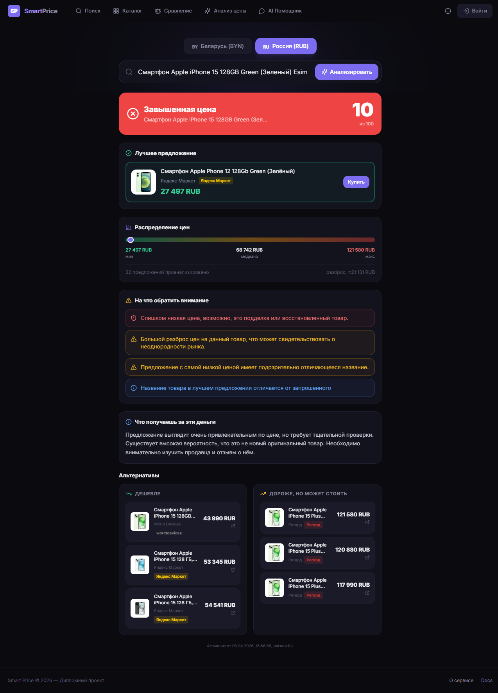
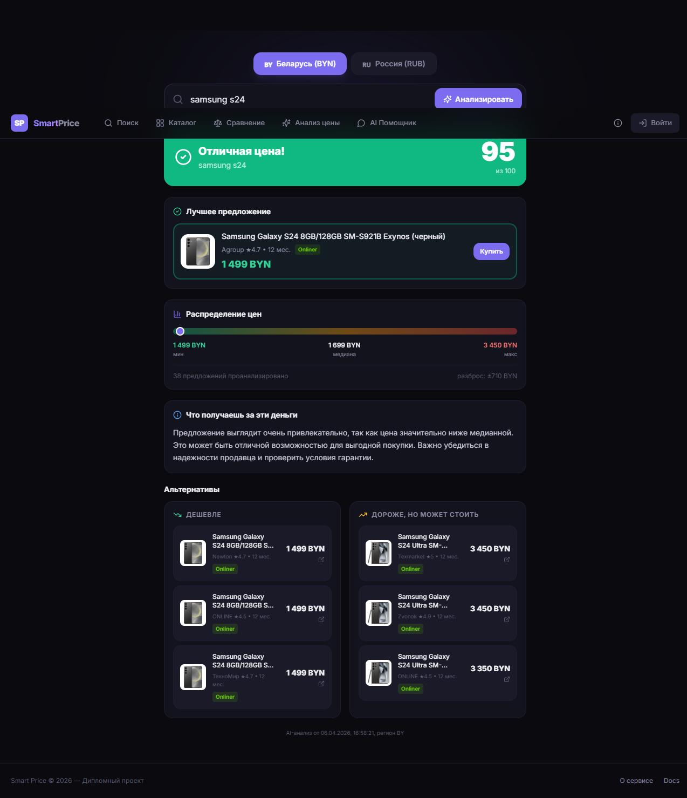
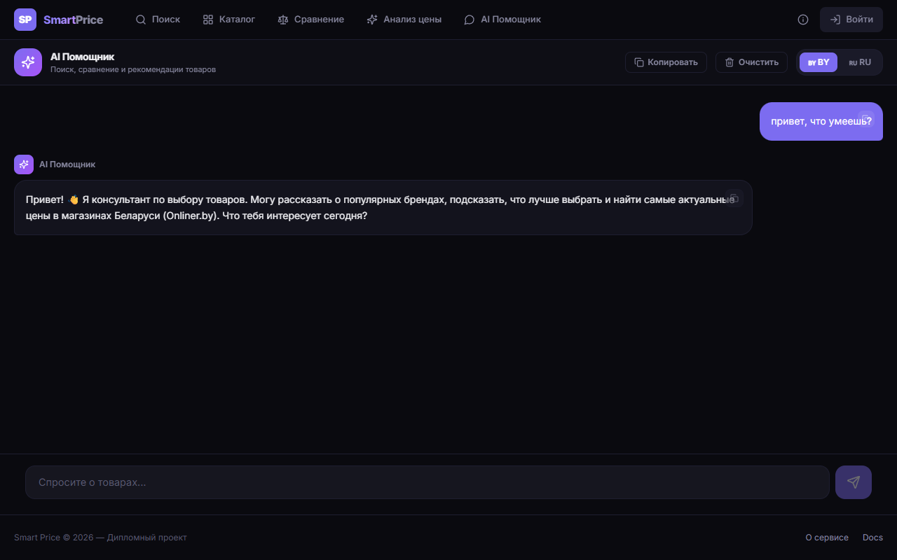
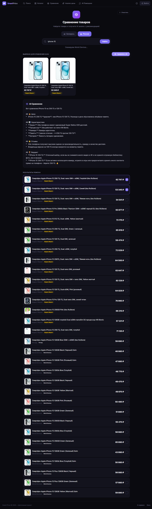
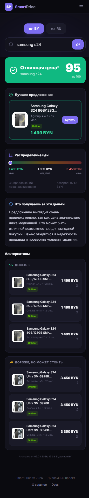

<div align="center">

# 🛍 Smart Price

### AI-агрегатор и анализатор цен с маркетплейсов России и Беларуси

Один поиск — все магазины. AI-помощник, который реально читает выдачу и говорит, переплачиваешь ли ты.

[](https://smrt-price.ru)
[](LICENSE)
[](https://www.python.org/)
[](https://nextjs.org/)
[](https://fastapi.tiangolo.com/)

[**🌐 Открыть демо**](https://smrt-price.ru) · [Возможности](#-возможности) · [Технологии](#-технологии) · [Запуск локально](#-запуск-локально) · [Архитектура](#-архитектура)



</div>

---

## 💡 Что это

**Smart Price** — это сервис, который ищет один и тот же товар одновременно в нескольких маркетплейсах, показывает все цены в одном окне и подключает AI, чтобы понять: **выгодная цена или переплата?**

Поддерживаются два рынка с раздельной валютной изоляцией:

- 🇷🇺 **Россия** — Яндекс.Маркет, Озон, Regard
- 🇧🇾 **Беларусь** — Onliner.by, WorldDevices

Внутри живёт AI-помощник по имени **ЕГОРУШКА** — он умеет искать товары, сравнивать модели и анализировать справедливость цены, никогда не выдумывая цифры (защита от галлюцинаций встроена в архитектуру).

> **Production:** [https://smrt-price.ru](https://smrt-price.ru) · **Backend API:** `/api/v1/` · **Документация Swagger:** `/docs`

---

## ✨ Возможности

### 🔍 Мета-поиск с потоковой выдачей

Один запрос — параллельный обход всех подключённых маркетплейсов через **Server-Sent Events**. Карточки товаров появляются по мере того, как скрейперы возвращают данные, а не «всё разом через 15 секунд». Под капотом — антидетект, гибридные HTTP/Playwright стратегии и AI-фильтрация нерелевантных результатов.

### 🔬 AI-анализ цены *(флагманская фича)*

Пользователь вводит название товара → бэкенд собирает все предложения, фильтрует мусор (восстановленные, нет в наличии, выбросы за 3σ), считает статистику в Python (`min`, `median`, `mean`, `max`, `stdev`), и только потом передаёт это **Google Gemini 2.0 Flash** через OpenRouter с жёстким промптом.

На выходе:

- 🟢/🟡/🔴 **вердикт** — «Отличная цена» / «Средне» / «Завышенная цена»
- **score** из 100
- **лучшее предложение** с прямой ссылкой в магазин
- **красные флаги** (восстановленные, серый импорт, подозрительно низкая цена)
- **«что ты получаешь за эти деньги»** — описание ключевых характеристик
- **альтернативы** дешевле на 20% и дороже на 20%

> **Анти-галлюцинация:** все цены и числа берутся **из Python**, не из LLM. Модель отвечает только за словесную часть и через regex-гард не может протащить выдуманную цифру в narrative-поле. Гарантирует диплом-уровень корректности.

<div align="center">
  
  <p><em>Пример: AI-анализ Samsung Galaxy в белорусском регионе — вердикт «Отличная цена», 95/100, все данные в BYN</em></p>
</div>

### 💬 AI-помощник ЕГОРУШКА

Чат с **tool-use**: помощник сам решает, что вызвать — поиск, сравнение или анализ. Поддерживает многоходовые диалоги, помнит критерии пользователя («подбери смартфон до 1000 BYN с хорошей зарядкой» → «теперь сравни эти варианты» → таблица с правильными строками).

<div align="center">
  
</div>

### ⚖️ AI-сравнение товаров

Добавь любые товары из поиска в корзину сравнения, нажми «Сравнить с AI» → бэкенд через SSE генерирует подробную **markdown-таблицу**: цена, характеристики, отзывы, итоговый вердикт. Состояние сравнения переживает навигацию между страницами через `localStorage` (одна из наших священных UX-инвариантов).

<div align="center">
  
</div>

### 📱 Адаптив под мобилки

Каждая страница протестирована на iPhone SE (375×667). Никакого горизонтального скролла, тапабельные кнопки, читаемые карточки. Comparison-таблица скроллится горизонтально без поломки лейаута.

<div align="center">
  
</div>

### 🌍 Региональная изоляция валют

Переключатель **🇷🇺 RUB** / **🇧🇾 BYN** в шапке. Запросы идут в магазины соответствующего региона, статистика по ценам **никогда не смешивает валюты** — это защищено на уровне Pydantic-валидации (`region="all"` отдаёт HTTP 422).

---

## 🛠 Технологии

### Backend

| Слой | Стек |
|---|---|
| API | **FastAPI 0.115**, Pydantic v2, async/await |
| База данных | **PostgreSQL 16**, SQLAlchemy 2.0 (asyncpg), Alembic |
| Кеш / очереди | **Redis 7** |
| AI / LLM | **Google Gemini 2.0 Flash** через OpenRouter, OpenAI SDK, Anthropic SDK |
| Скрейпинг | **Playwright** + httpx (гибридные стратегии), antidetect |
| Стриминг | **Server-Sent Events** (SSE) для поиска, чата, сравнения и анализа |
| Тесты | pytest, pytest-asyncio, ruff, mypy |

### Frontend

| Слой | Стек |
|---|---|
| Фреймворк | **Next.js 14** (App Router, static export) |
| UI | **React 18**, **TailwindCSS 3.4**, lucide-react иконки |
| Состояние | **Zustand**, **TanStack Query** (React Query) |
| Markdown | react-markdown с поддержкой таблиц |
| TypeScript | strict mode, 0 ошибок `tsc --noEmit` |

### Инфраструктура

- **Docker Compose** (4 контейнера: backend, postgres, redis, nginx)
- **nginx** обратный прокси с правильной SSE конфигурацией (`proxy_http_version 1.1`, `Connection ""`, `proxy_buffering off`)
- **VPS** на Ubuntu, CI/CD через scp + `docker compose build && up -d`

---

## 🏗 Архитектура

```
                            ┌─────────────────────────┐
                            │        Browser          │
                            │  Next.js 14 (App Router)│
                            └───────────┬─────────────┘
                                        │ HTTPS
                                        ▼
                            ┌─────────────────────────┐
                            │         nginx           │
                            │  • статика /out         │
                            │  • SSE proxy /api/v1/*  │
                            │  • 404.html fallback    │
                            └───────────┬─────────────┘
                                        │
                                        ▼
                            ┌─────────────────────────┐
                            │   FastAPI (uvicorn)     │
                            │                         │
                            │  ┌───────────────────┐  │
                            │  │ /search/stream    │──┼──┐
                            │  │ /analyze/stream   │  │  │
                            │  │ /ai/chat          │  │  │
                            │  │ /ai/compare       │  │  │
                            │  └───────────────────┘  │  │
                            │                         │  │
                            │  ┌───────────────────┐  │  │
                            │  │ ScraperManager    │◄─┘  │
                            │  │   ├ Yandex.Market │     │
                            │  │   ├ Ozon          │     │
                            │  │   ├ Regard        │     │
                            │  │   ├ Onliner.by    │     │
                            │  │   └ WorldDevices  │     │
                            │  └───────────────────┘     │
                            │                            │
                            │  ┌───────────────────┐     │
                            │  │ PriceAnalyzer     │     │
                            │  │ • cleanup         │     │
                            │  │ • statistics      │     │
                            │  │ • LLM verdict     │◄────┘
                            │  └────────┬──────────┘
                            │           │
                            └───────────┼─────────────┘
                                        │
                            ┌───────────▼─────────────┐
                            │  OpenRouter → Gemini    │
                            │  2.0 Flash (JSON mode)  │
                            └─────────────────────────┘
```

**Ключевая идея анти-галлюцинации:** LLM получает отфильтрованную выборку офферов и статистику, но возвращает только субъективные поля (`verdict`, `score`, `red_flags`, `value_analysis`). Все цены, лучший оффер и альтернативы вычисляются в Python поверх ответа модели — модель физически не может выдумать цену.

---

## 🚀 Запуск локально

### Требования

- **Docker** и Docker Compose
- **Python 3.11+**
- **Node.js 20+**
- API-ключ OpenRouter (бесплатный тариф работает) — [openrouter.ai](https://openrouter.ai/)

### 1. Клонировать репозиторий

```bash
git clone https://github.com/EgorSanko/smart-price.git
cd smart-price
```

### 2. Настроить переменные окружения

```bash
# Backend
cp backend/.env.example backend/.env
# Открыть backend/.env и вписать:
#   OPENROUTER_API_KEY=sk-or-v1-...
#   AI_MODEL=google/gemini-2.0-flash-001
#   POSTGRES_PASSWORD=любой_пароль
#   SECRET_KEY=случайная_строка

# Frontend
cp frontend/.env.example frontend/.env.local
# По умолчанию уже стоит NEXT_PUBLIC_API_URL=http://localhost:8000
```

### 3. Запустить через Docker Compose

```bash
docker compose up -d
docker compose ps   # все 4 контейнера должны быть Up (healthy)
```

### 4. Запустить frontend в dev-режиме

```bash
cd frontend
npm install
npm run dev
```

### 5. Открыть в браузере

| Сервис | URL |
|---|---|
| **Веб-приложение** | http://localhost:3000 |
| **Backend API** | http://localhost:8000 |
| **Swagger UI** | http://localhost:8000/docs |
| **PostgreSQL** | localhost:5432 |
| **Redis** | localhost:6379 |

### Запуск backend локально (без Docker)

```bash
cd backend
python -m venv .venv
.venv\Scripts\activate          # Windows
# source .venv/bin/activate     # Linux/Mac
pip install -e ".[dev]"
alembic upgrade head
uvicorn app.main:app --reload --port 8000
```

---

## 📡 Ключевые endpoint'ы

| Метод | Путь | Описание |
|---|---|---|
| `GET` | `/api/v1/health` | Проверка здоровья |
| `GET` | `/api/v1/live-search/stream?q=<>&region=<RU\|BY>` | SSE-поиск по всем маркетплейсам |
| `GET` | `/api/v1/analyze/stream?q=<>&region=<RU\|BY>` | SSE AI-анализ цены товара |
| `POST` | `/api/v1/ai/chat` | SSE-чат с ЕГОРУШКОЙ (tool-use) |
| `POST` | `/api/v1/ai/compare` | SSE AI-сравнение нескольких товаров |
| `GET` | `/docs` | Полная Swagger UI документация |

Все стриминговые эндпоинты используют `Content-Type: text/event-stream` + `Transfer-Encoding: chunked` + `proxy_http_version 1.1` со стороны nginx.

---

## 🤖 Multi-agent разработка

В проекте используется кастомный workflow на базе **Claude Code** с 7 специализированными агентами, каждый со своей зоной ответственности:

| Агент | Модель | Зона ответственности |
|---|---|---|
| **architect** | Opus | финализирует план фичи, ищет дыры до того как пишется код |
| **backend-dev** | Sonnet | пишет endpoint'ы, сервисы, схемы |
| **frontend-dev** | Sonnet | пишет страницы, компоненты, API-клиенты |
| **chat-tester** | Sonnet | проверяет LLM-промпты на галлюцинации цен и валидность JSON |
| **scraper-tester** | Sonnet | smoke-тесты скрейперов, поиск регрессий в выдаче магазинов |
| **deploy-verifier** | Sonnet | проверяет здоровье прода после деплоя за 60 секунд |
| **regression-tester** | Opus | финальный E2E прогон через Playwright Edge на проде, блокирует «готово» если что-то отвалилось |

Конфигурация агентов лежит в [`.claude/agents/`](.claude/agents/). Каждый агент знает свои hard-rules, чек-листы для текущего проекта (например, `regression-tester` хранит исторический список багов D1–D9, которые должны оставаться зафиксенными) и формат итогового отчёта.

> **Зачем это нужно.** Один Claude как «технический лид» оркестрирует агентов, делегируя по ролям. Агенты ловят регрессии, vendor drift в собственных конфигах и забытые миграции до того, как пользователь увидит баг. Результат: фичу можно довести от идеи до прода без багов за один сеанс.

---

## 📁 Структура проекта

```
smart-price/
├── backend/                    # FastAPI backend
│   ├── app/
│   │   ├── api/v1/endpoints/   # search_stream, analyze, chat, compare, ...
│   │   ├── agents/             # shopping_agent (ЕГОРУШКА tool-use)
│   │   ├── scrapers/           # yandex_market, ozon, onliner, regard, ...
│   │   ├── services/           # price_analyzer, cleanup
│   │   ├── schemas/            # Pydantic v2
│   │   ├── db/                 # SQLAlchemy 2.0 модели
│   │   └── core/               # config, security
│   ├── tests/
│   ├── pyproject.toml
│   └── Dockerfile.prod
│
├── frontend/                   # Next.js 14 frontend
│   └── src/app/
│       ├── page.tsx            # главная (поиск)
│       ├── analyze/            # AI-анализ цены
│       ├── chat/               # ЕГОРУШКА
│       ├── compare/            # сравнение товаров
│       ├── product/            # карточка товара
│       └── not-found.tsx       # кастомная 404
│
├── nginx/
│   └── nginx.conf              # SSE-aware proxy
│
├── .claude/
│   ├── agents/                 # 7 специализированных агентов
│   └── commands/               # кастомные slash-команды
│
├── docs/
│   └── images/                 # скриншоты для README
│
├── docker-compose.yml
└── README.md
```

---

## 🎓 О проекте

Smart Price изначально создавался как дипломная работа на тему **«AI-анализ цен на маркетплейсах»** в 2026 году. Сейчас это работающий продакшен-сервис на [smrt-price.ru](https://smrt-price.ru), который продолжает развиваться.

Ключевые идеи, отрабатываемые в проекте:

- **AI без галлюцинаций** через гибридную архитектуру (числа из кода, словесная часть из LLM)
- **Server-Sent Events** для прогрессивной выдачи (лучший UX чем «крутилка на 15 секунд»)
- **Multi-agent dev workflow** — оркестрация специализированных AI-агентов как способ удержать качество в одиночной разработке

---

## 📜 Лицензия

[MIT](LICENSE) © 2026 Egor Sanko

---

## 🙏 Благодарности

- [FastAPI](https://fastapi.tiangolo.com/) — основа бэкенда
- [Next.js](https://nextjs.org/) — основа фронтенда
- [OpenRouter](https://openrouter.ai/) — единый шлюз для LLM
- [Playwright](https://playwright.dev/) — скрейпинг и регрессионные тесты
- [Anthropic Claude Code](https://claude.com/claude-code) — multi-agent разработка

---

<div align="center">

**Если проект показался полезным — поставь ⭐**

Made with ❤ in Belarus

</div>
